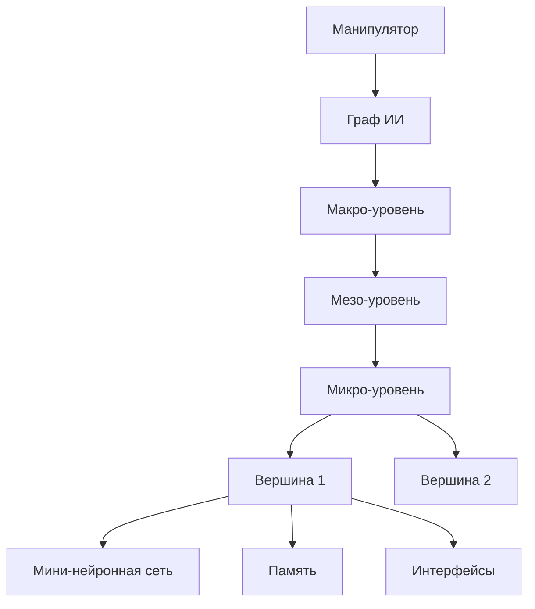
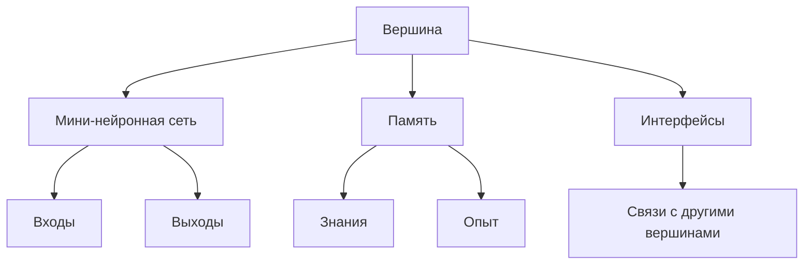
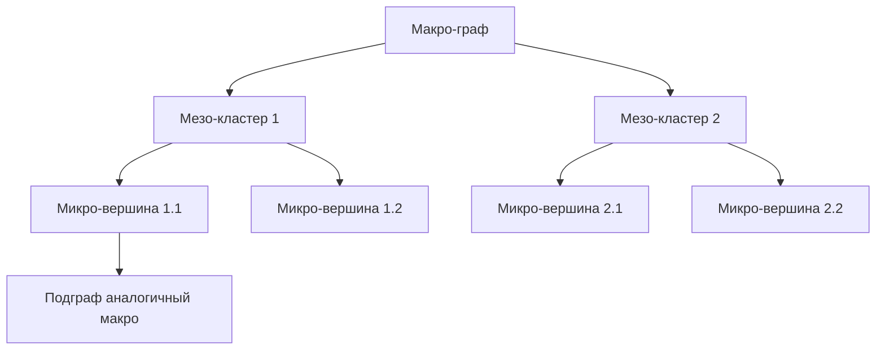

# Фрактальная Графовая Архитектура ИИ (Fractal Graph AI Architecture)

## Обзор
На основе анализа MSB архитектуры, предлагается фрактальная графовая архитектура ИИ, вдохновленная человеческим мозгом. Архитектура состоит из вершин (мини-нейронных сетей), связей между ними, иерархических уровней с самоподобием, и оркестрируемого манипулятора. Поддерживает параллелизм, самообучение, динамическое расширение и распределение знаний.

## Основные Компоненты

### 1. Вершина (Node)
Каждая вершина представляет собой мини-нейронную сеть ("столбец"), аналогичную колонке в неокортексе.
- **Мини-нейронная сеть**: Слой нейронов для обработки входных данных, обучения и инференса.
- **Память**: Хранение знаний, опыта и паттернов. Включает долгосрочную память (знания) и краткосрочную (активные состояния).
- **Интерфейсы**: Входы/выходы для связей с другими вершинами.
- **Аналогия с мозгом**: Вершина как зона мозга, ответственная за конкретные функции (зрение, язык и т.д.).

### 2. Связи (Edges)
- **Типы**: Экзитаторные (возбуждающие), ингибиторные (тормозящие), нейтральные.
- **Веса**: Динамически адаптируемые на основе обучения.
- **Топология**: Графовая структура с кластерами (зоны как полушария мозга).

### 3. Уровни Иерархии (Hierarchical Levels)
Фрактальность обеспечивается самоподобием на уровнях:
- **Микро-уровень**: Индивидуальные вершины и их связи.
- **Мезо-уровень**: Кластеры вершин (зоны).
- **Макро-уровень**: Полный граф как мозг.

Каждый уровень может содержать подграфы, аналогичные полному графу.

### 4. Манипулятор (Manipulator)
Оркестрирует систему:
- Создание/удаление вершин.
- Обучение и инференс.
- Распределение знаний.
- Оптимизация топологии.

### 5. Механизмы Параллелизма
- Асинхронное обучение: Вершины обучаются параллельно.
- Распределенные вычисления: Использование кластеров для масштабирования.
- Инференс: Параллельная обработка запросов.

### 6. Самообучение
- **Адаптация связей**: Обратное распространение и reinforcement learning.
- **Динамическое создание вершин**: Кластеризация входных паттернов.
- **Эволюционные алгоритмы**: Оптимизация топологии графа.

## Взаимодействия
- **Обучение**: Входные данные передаются через граф, вершины обучаются, связи адаптируются.
- **Инференс**: Запросы обрабатываются параллельно, результаты агрегируются.
- **Распределение знаний**: Манипулятор копирует знания между вершинами.
- **Динамическое расширение**: Новые вершины создаются на основе паттернов.

## Диаграммы

### Общая Архитектура

### Структура Вершины

### Иерархия Уровней

## Рекомендации по Реализации
- **Библиотеки**: PyTorch для нейронных сетей, DGL для графовых операций, Ray для параллелизма.
- **Интеграция с MSB**: Использовать BaseEntity для вершин, BaseContainer для кластеров, Manipulator для оркестрации.
- **Тестирование**: Unit tests для вершин, integration tests для графа, benchmarks для производительности и масштабируемости.
- **Развертывание**: Начать с малого графа, постепенно расширять. Мониторить ресурсы для параллелизма.